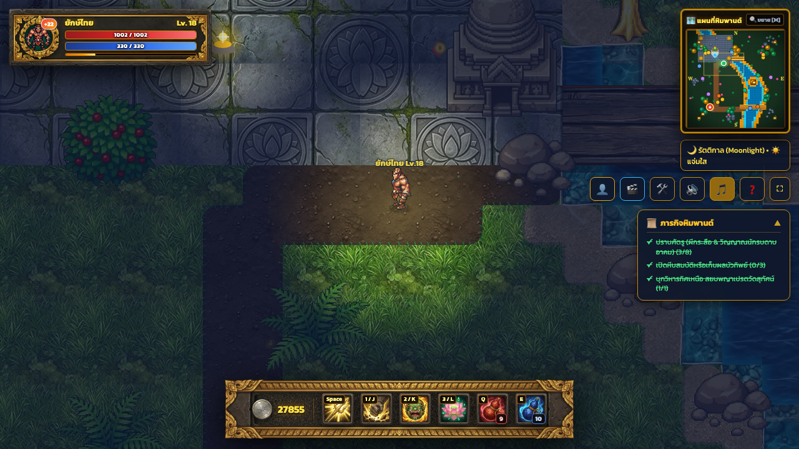

# 🎮 Yaksha RPG: ตำนานศึกยักษ์พิทักษ์หิมพานต์

เกมแอ็กชัน RPG 2D มุมมอง Top-Down (8 ทิศทาง) ในธีมตำนานวรรณคดีไทยและป่าหิมพานต์ ผสมผสานกราฟิกสไตล์ Retro 16-Bit / 32-Bit Pixel Art เข้ากับ UI ศิลาแลงโบราณสลักลายกนกปิดทองคำเปลวแท้ พร้อมระบบแผนที่พลวัตและระบบฐานข้อมูล SQLite รองรับการเล่นผ่าน Localhost และเครือข่ายวงแลน (LAN)

---

## 📸 ภาพตัวอย่างภายในเกม (Gameplay Preview)



---

## 🌟 ฟีเจอร์เด่นของเกม (Key Features)

1. **ระบบควบคุมและเคลื่อนที่ 8 ทิศทางเต็มรูปแบบ (True 8-Directional Movement)**
   - ตัวละครยักษ์และมอนสเตอร์ทุกตัวมีการเรนเดอร์ภาพเคลื่อนไหวครบทั้ง 8 ทิศ (S, SE, E, NE, N, NW, W, SW)
   - การก้าวเดิน แอนิเมชันการฟัน การใช้สกิล และเงาตกกระทบสมจริง

2. **ระบบการต่อสู้และอาคมไทยโบราณ (Skills & Combat System)**
   - **โจมตีปกติ (เพลงกระบองยักษ์ตรีศูล)**: กวัดแกว่งตรีศูลสร้างคลื่นพลังทองคำ
   - **สกิล 1 (ยักษ์ทุบปฐพี)**: ทุบพื้นสร้างรอยแยกธรณีสูบพร้อมประกายอัสนีบาต (Stun & AoE)
   - **สกิล 2 (คำรามก้องฟ้า)**: ปลดปล่อยคลื่นเสียงอสูรคำราม ขยายพลังโจมตีและเผาไหม้ศัตรู
   - **สกิล 3 (มนต์ฟื้นกายา)**: ดอกบัวทิพย์หิมพานต์ผลิบาน ฟื้นฟูพลังชีวิตและสร้างเกราะอาคมคุ้มกัน
   - **น้ำเต้าโอสถชาด & น้ำเต้าอาคมคราม**: ฟื้นฟู HP และ MP

3. **ระบบผู้ดูแลและสตูดิโอสร้างแมพ (Admin Studio & Map Editor - `admin.html`)**
   - **🗺️ Map Editor**: เครื่องมือระบายพื้นกระเบื้อง (หญ้า, แม่น้ำ, ทางเดินดิน, ลานหินวิหาร, สะพานไม้), วางสิ่งก่อสร้าง (พระอุโบสถวัดพระแก้ว, เจดีย์, โพธิ์ไทร), วางกล่องสมบัติ และวางมอนสเตอร์
   - **👹 Monster & Boss Balancing**: ปรับแต่งค่าพลังมอนสเตอร์และบอสทุกตัวแบบสดๆ (HP, Attack, Cooldown, Speed, EXP, Gold)
   - **🛡️ Monster Studio (8-Direction Gatekeeper)**: ระบบตรวจเช็กและนำเข้ามอนสเตอร์ใหม่ พร้อมระบบ Gatekeeper ที่บล็อกไม่ให้มอนสเตอร์ที่มีภาพไม่ครบ 8 ทิศทางลงเกมโดยเด็ดขาด

4. **เซิร์ฟเวอร์และฐานข้อมูล (SQLite & LAN Ready)**
   - ระบบเซฟเกม, แมพ, การตั้งค่ามอนสเตอร์ และความคืบหน้าของตัวละครถูกจัดเก็บใน SQLite (`game_data.db`)
   - รองรับการเชื่อมต่อข้ามอุปกรณ์ในวง Wi-Fi เดียวกัน เล่นผ่านมือถือหรือแท็บเล็ตได้ทันที

---

## ⌨️ ปุ่มควบคุมและคีย์ลัด (Controls & Shortcuts)

| การกระทำ | คีย์บอร์ด (Key) | เมาส์ (Mouse) / ทางเลือก |
| :--- | :--- | :--- |
| **เคลื่อนที่ 8 ทิศทาง** | `W` `A` `S` `D` หรือปุ่มลูกศร | คลิกทิศทางที่ต้องการเดิน |
| **โจมตีปกติ** | `Spacebar` | คลิกซ้ายที่ศัตรู |
| **สกิล 1: ยักษ์ทุบปฐพี** | `1` หรือ `J` | คลิกไอคอนสกิล 1 บน Hotbar |
| **สกิล 2: คำรามก้องฟ้า** | `2` หรือ `K` | คลิกไอคอนสกิล 2 บน Hotbar |
| **สกิล 3: มนต์ฟื้นกายา** | `3` หรือ `L` | คลิกไอคอนสกิล 3 บน Hotbar |
| **ดื่มน้ำเต้าฟื้นเลือด (HP)** | `Q` | คลิกไอคอนน้ำเต้าแดง |
| **ดื่มน้ำเต้าฟื้นมานา (MP)** | `E` | คลิกไอคอนน้ำเต้าน้ำเงิน |
| **ดูแผนที่ / มินิแมพ** | `M` | คลิกการ์ดมินิแมพมุมบนขวา |
| **โหมดสร้างแมพ (Admin)** | เข้าใช้งานผ่าน `admin.html` | - |

---

## 🚀 วิธีการติดตั้งและรันเกม (Getting Started)

### ความต้องการของระบบ:
- Python 3.8 ขึ้นไป
- เว็บบราวเซอร์เวอร์ชันใหม่ (Google Chrome, Safari, Microsoft Edge, Firefox)

### ขั้นตอนการรัน:
1. **เปิดเซิร์ฟเวอร์เกม**:
   ```bash
   python3 server.py
   ```
2. **เข้าเล่นเกม**:
   - เปิดบราวเซอร์ไปที่: **`http://localhost:8001/`**
   - หรือหากเล่นผ่านมือถือ/แท็บเล็ตในวง Wi-Fi เดียวกัน ให้เปิด: **`http://<IP-เครื่องเซิร์ฟเวอร์>:8001/`** (เซิร์ฟเวอร์จะแสดง IP ขึ้นมาบน Terminal)
3. **เข้าสู่ระบบผู้ดูแล (Admin Studio)**:
   - เปิดบราวเซอร์ไปที่: **`http://localhost:8001/admin.html`**

---

## 🛡️ คู่มือการใช้งาน Monster Studio & Gatekeeper (นำเข้ามอนสเตอร์ใหม่)

เพื่อรักษาคุณภาพและความสมบูรณ์ของเกม ระบบมีตัวตรวจสอบ **Gatekeeper** ที่เข้มงวด:
1. เข้าไปที่ **`http://localhost:8001/admin.html`** และเลือกแท็บ **"🛡️ ระบบตรวจ & นำเข้ามอนสเตอร์"**
2. คลิกปุ่ม **"+ เพิ่มมอนสเตอร์ใหม่ (8 ทิศทาง)"**
3. ระบุชื่อและรหัสมอนสเตอร์ (ภาษาอังกฤษพิมพ์เล็ก เช่น `naga_warrior`)
4. นำเข้ารูปภาพ 8 ทิศทางได้ 2 รูปแบบ:
   - **รูปแบบที่ 1 (อัปโหลดตาราง Spritesheet 2x4)**: ใส่ไฟล์ภาพตาราง 8 ทิศภาพเดียว ระบบจะแบ่งตัด 8 ทิศทางให้อัตโนมัติ
   - **รูปแบบที่ 2 (อัปโหลดแยก 8 ช่อง)**: ลากไฟล์รูปใส่ช่อง 8 ทิศทางตามเข็มทิศ
5. **การอนุมัติของ Gatekeeper**:
   - หากภาพครบทั้ง 8 ทิศ 100% -> ปุ่มบันทึกจะปลดล็อก `💾 บันทึกและนำเข้าสู่เกม`
   - หากขาดทิศใดทิศหนึ่ง -> ปุ่มจะล็อก `🔒` และไม่สามารถนำเข้าเกมได้
6. เมื่อบันทึกสำเร็จ มอนสเตอร์จะปรากฏในพาเล็ตของ **Map Editor** และพร้อมวางลงบนแผนที่เกมทันที!

---

## 📂 โครงสร้างโปรเจกต์ (Project Structure)

```text
RpgGameTest/
├── index.html              # หน้าจอเกมหลัก (Gameplay Screen)
├── admin.html              # หน้าผู้ดูแลระบบ (Map Editor, Monster Studio, Boss Balancing)
├── studio_anim.html        # สตูดิโอตรวจสอบแอนิเมชันมอนสเตอร์ 8 ทิศทาง
├── server.py               # Backend Server & REST API (Python HTTP + SQLite)
├── game_data.db            # ฐานข้อมูล SQLite (Maps, Boss Configs, World Saves, Monsters)
├── js/
│   ├── game.js             # ลูปเกมหลักและระบบเรนเดอร์ (Core Game Loop)
│   ├── assets.js           # ระบบโหลดภาพและสไปรต์ตัวละคร (Asset Manager)
│   ├── enemies.js          # ระบบ AI และพฤติกรรมมอนสเตอร์/บอส (Enemy System)
│   ├── map_editor.js       # เครื่องมือแก้ไขแผนที่ (Map Editor Controller)
│   ├── monster_studio.js   # ระบบตรวจเช็ก Asset 8 ทิศและตัวนำเข้า (Monster Studio)
│   ├── boss_settings.js    # ระบบปรับแต่งสมดุลมอนสเตอร์และบอส (Balancing Controller)
│   ├── player.js           # ตัวละครผู้เล่น การเคลื่อนที่ และการใช้สกิล
│   └── sound.js            # ระบบเสียงสังเคราะห์เอฟเฟกต์และดนตรี
├── Assets/                 # โฟลเดอร์สไปรต์และภาพกราฟิกทั้งหมด
│   ├── yak/                # ตัวละครยักษ์ไทย (ผู้เล่น) และเอฟเฟกต์อาคม
│   ├── bosspreat/          # พญาเปรตวัดสุทัศน์ และเอฟเฟกต์ท่าอเวจี
│   ├── buffalo/            # พญาควายธนูทมิฬ
│   ├── tiger/              # เสือสมิง
│   ├── krasue/             # ผีกระสือ
│   ├── monkey/             # วานรปีศาจ (ครบ 8 ทิศทาง)
│   ├── serpent/            # พญางูอสูร (ครบ 8 ทิศทาง)
│   ├── imp/                # ภูตเงา (ครบ 8 ทิศทาง)
│   ├── map_assets/         # กระเบื้องฉาก พื้นหญ้า แม่น้ำ และสิ่งปลูกสร้าง
│   └── ui/                 # กรอบศิลาแลงและไอคอนสกิลโบราณ
└── screenshots/            # ภาพสกรีนช็อตของเกม
    └── game_preview.png
```

---

## 📜 ลิขสิทธิ์และการพัฒนา (License)
พัฒนาขึ้นสำหรับโปรเจกต์เกม RPG ตำนานหิมพานต์ไทย สามารถนำไปต่อยอดและพัฒนาต่อได้ตามต้องการ
